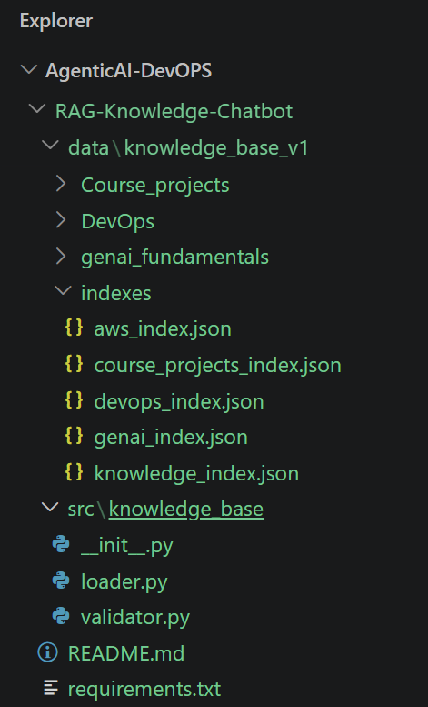

# Knowledge Base Module (Team 1)

This module is responsible for **creating, managing, validating, and loading the knowledge base** used in the RAG (Retrieval-Augmented Generation) project. It ensures that all knowledge files (AI fundamentals, DevOps, AWS Cloud, Course Projects) are consistent, modular, and ready for retrieval and embedding.

---

## 📌 Responsibilities
- Maintain **raw knowledge base** (`data/knowledge_base.json`).
- Organize **modular JSON files** (e.g., `aws_index.json`, `genai_index.json`, `devops_index.json`, `course_projects_index.json`).
- Provide a **master index** (`knowledge_index.json`) for unified access.
- Validate schema consistency across all JSON files.
- Expose loader utilities for other teams (retrieval, guardrails, generation).

---

## 📂 Folder Structure

AgenticAI-DevOPS/
└── RAG-Knowledge-Chatbot/
    ├── data/
    │   └── knowledge_base_v1/
    │       ├── Course_projects/          # Project-based reference material
    │       ├── DevOps/                   # DevOps concepts, tooling, pipelines
    │       ├── genai_fundamentals/       # GenAI / LLM foundational notes
    │       └── indexes/                  # Pre-built retrieval indexes
    │           ├── aws_index.json
    │           ├── course_projects_index.json
    │           ├── devops_index.json
    │           ├── genai_index.json
    │           └── knowledge_index.json  # Master / merged index
    ├── src/
    │   └── knowledge_base/
    │       ├── _init_.py
    │       ├── loader.py                 # Loads & parses knowledge base documents
    │       └── validator.py              # Validates document + index integrity
    ├── README.md
    └── requirements.txt
---

## ⚙️ Files Overview

### `__init__.py`
- Initializes the package.
- Exposes `KnowledgeBaseLoader` and `KnowledgeBaseValidator`.

### `loader.py`
- Loads raw KB and modular index files.
- Merges them into a unified dictionary.
- Calls the validator to ensure schema consistency.
- Provides helper methods:
  - `load_file(filename)`
  - `load_index(index_file)`
  - `merge_all()`

### `validator.py`
- Defines a JSON schema for KB entries.
- Uses `jsonschema` to validate required fields (`id`, `course`, `category`, `topic`, `question`, `answer`).
- Ensures all entries are consistent before embedding.

---
Usage Example
python
from src.knowledge_base import KnowledgeBaseLoader

# Initialize loader
loader = KnowledgeBaseLoader(data_dir="data")

# Merge all KB files
knowledge = loader.merge_all()

# Access AWS topics
aws_topics = knowledge.get("aws_index", [])
print(f"Loaded {len(aws_topics)} AWS entries")
## 📦 Dependencies
Add the following to `requirements.txt`:

```txt
jsonschema==4.23.0   # Schema validation

# Shared dependencies across teams (already needed in pipeline)
langchain==0.2.14
openai==1.40.0
tiktoken==0.7.0
faiss-cpu==1.8.0
python-dotenv==1.0.1

✅ Integration with Other Teams
Team 2 (Retrieval): Uses the merged KB dictionary to embed text into vector stores.

Team 3 (Guardrails): Relies on categories (Safety, Optimization, etc.) for filtering.

Team 4 (Generation): Uses indexed KB entries to build context and prompts.

📝 Best Practices
Keep JSON files modular (one domain per file).

Always update knowledge_index.json when adding new domains.

Run validator.py before committing changes to ensure schema compliance.

Use versioning (knowledge_base_v1, knowledge_base_v2) for major updates.
